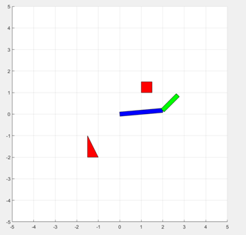

# justine-pro-1
Problem Statement :
Assume a two-arm manipulator with two revolute joints. Write a code in language of your choice (Matlab can be easy though) to do the following.\
1.Draw the robot world to display the robot and some polygonal obstacles.\
2.The code to generate the robot end effector workspace.\
3.The code should also generate the configuration space and display the configuration  space obstacles.\

Solution approach:\
1.The two arm are made and Plotted in graph using fill command(taking ttache vertex as input).\
2.Ploting the static  polygonal Obstacles\
3.Start a for loop for theta 1 (angle of first link from ground)\
4.Start a for loop for theta 2 (angle of second link from ground)\
5.Update all the vertex points using transformation matrix \
x_1=v_1x  cos⁡(θ_1 )\
y_1=v_1y sin⁡(θ_1) \
The above calculation shows a the transformation applied to a single vertex of link 1(Blue link). \
x_2=v_2x  cos⁡(θ_1+θ_2 )\
y_2=v_2y sin⁡(θ_1+θ_2) \
The above calculation shows a the transformation applied to a single vertex of link 2(Green link). \
6.Then plot the configuration space, for every theta1,theta2 combination plot red dot if collision If collision is happening,blue dot if the collision is not happening.\
7.End both the loops\

Results:
 
The Configuration in real world (Red Box is obstacle)\

 
The Workspace \

 
Configuration space\
\
The x axis and y axis are ranging from 0 to 360.Red dots denotes the Configuration of robots which results in collision with the object.

